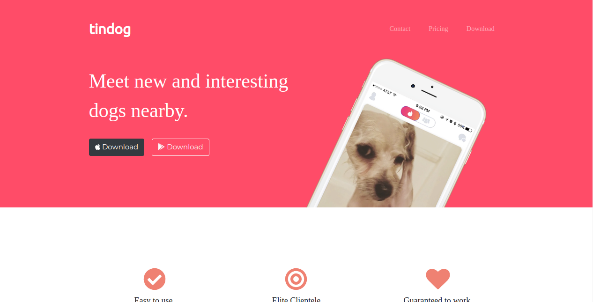
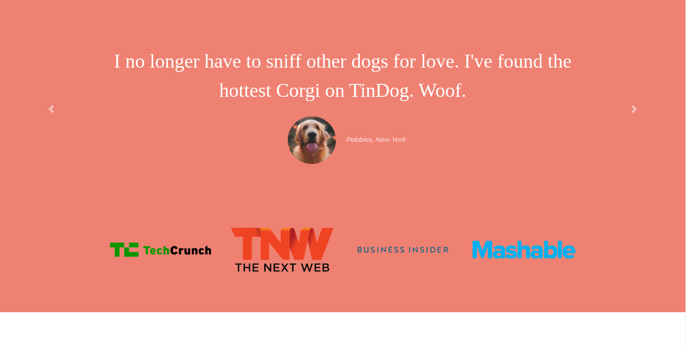
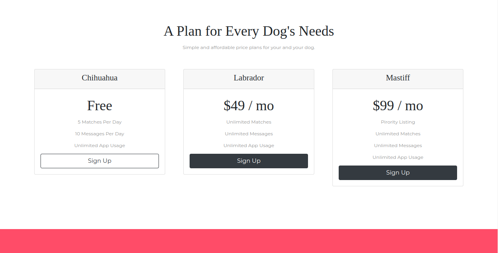
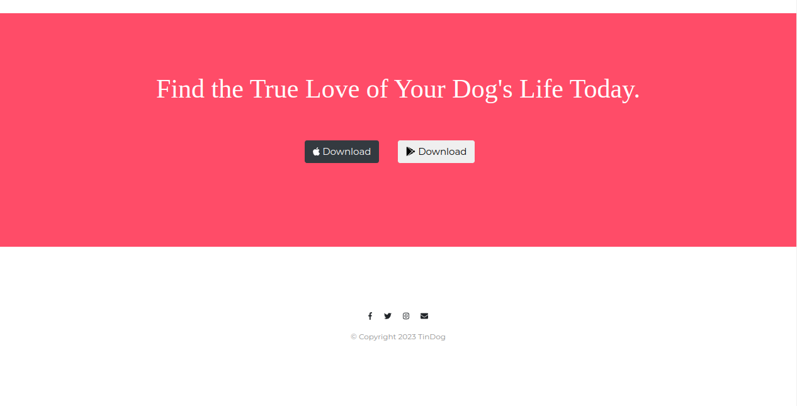

# Projeto Tindog, um tinder para cachorros

## Descrição

Este projeto visa criar uma aplicação web que simula o Tinder, mas para cachorros. O projeto foi desenvolvido durante um curso de Desenvolvimento Web Fll Stack da Udemy, ["The Complete 2023 Web Development Bootcamp"](https://www.udemy.com/course/the-complete-web-development-bootcamp/), ministrado pela instrutora Doutora Angela Yu.

No projeto foi utilizado apenas estilizações básicas de CSS, HTML e Bootstrap. O projeto foi desenvolvido com o intuito de praticar o uso de HTML e CSS e por em prática o que foi aprendido durante o curso, até então.

Para rodar o projeto, basta abrir o arquivo `index.html` no seu navegador.

Ou, você pode conferir como ficou o resultados [aqui](https://acgoularthub.github.io/Tindog/)!

### Observação:

O projeto foi desenvolvido sem o uso de tags semânticas e utilizando o bootsat  4.0 que não é mais utilizado atualmente. O projeto foi desenvolvido, originalmente, em 2018 e para que não houvessem discrepancias com o que foi ensinado no curso, o projeto foi mantido com as mesmas configurações.

## Imagens do projeto

